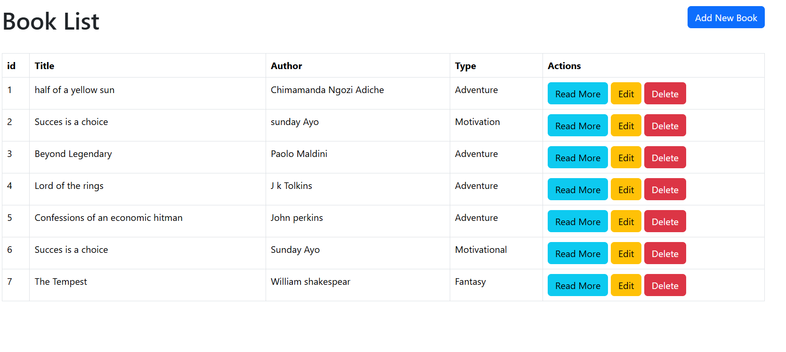
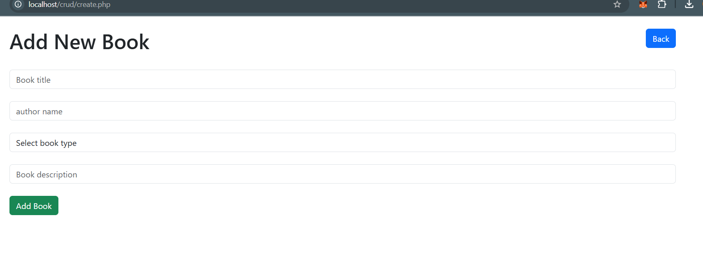
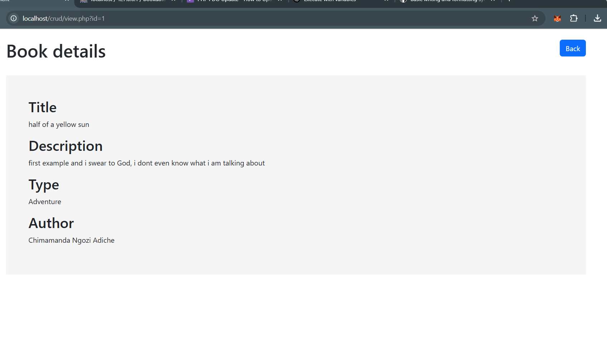
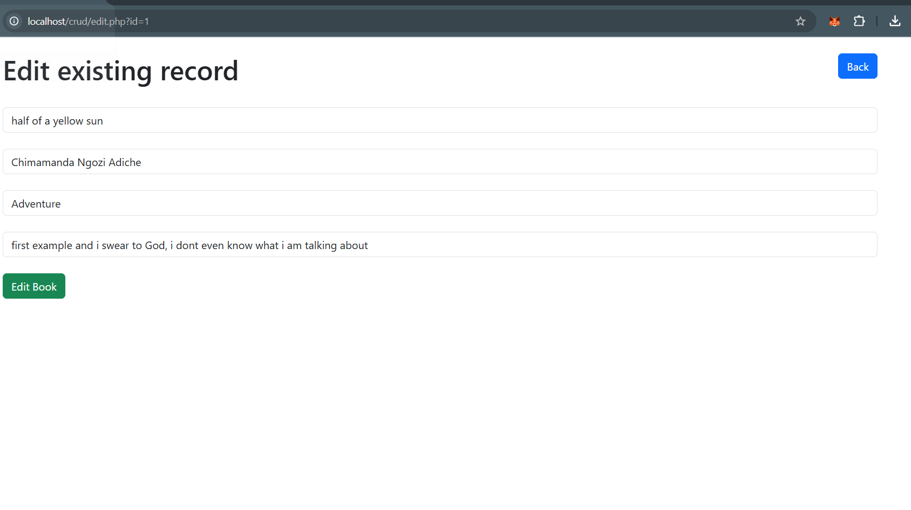

# PHP Assignments

## A crud application created using php

### featutes

1. index.php page to display all the list of books added to the database
   

2. the create.php page which adds an entire new book to the database
   

3. The readmore button when clicked, it takes you to the book details page and shows you a detailed information of the book you clicked based on the id
   

4. the edit.php which edits a particular book record on the database based on the id passed as a query string to it
   

5. The delete button completely removes a single record from the database base on the selected item on the book list
